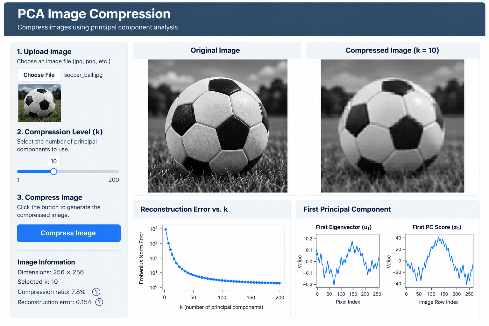

by Andrew Yu

## App Description

The PCA Image Compression app would allow users to upload an image and choose a compression level ((k)) using a slider. The controls would be placed on the left side of the application so they are easy to access. The original image and compressed image would be displayed side by side, allowing the user to easily compare the effects of different levels of compression.

## App Mockup

